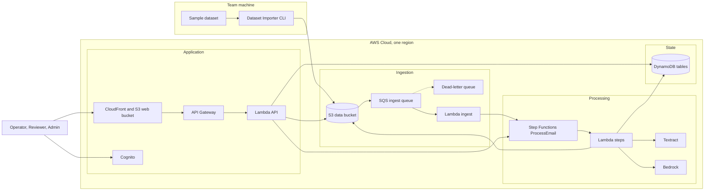
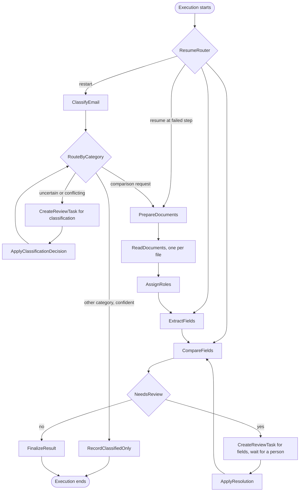
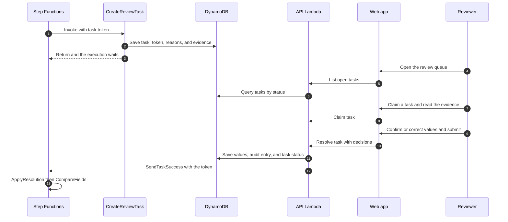
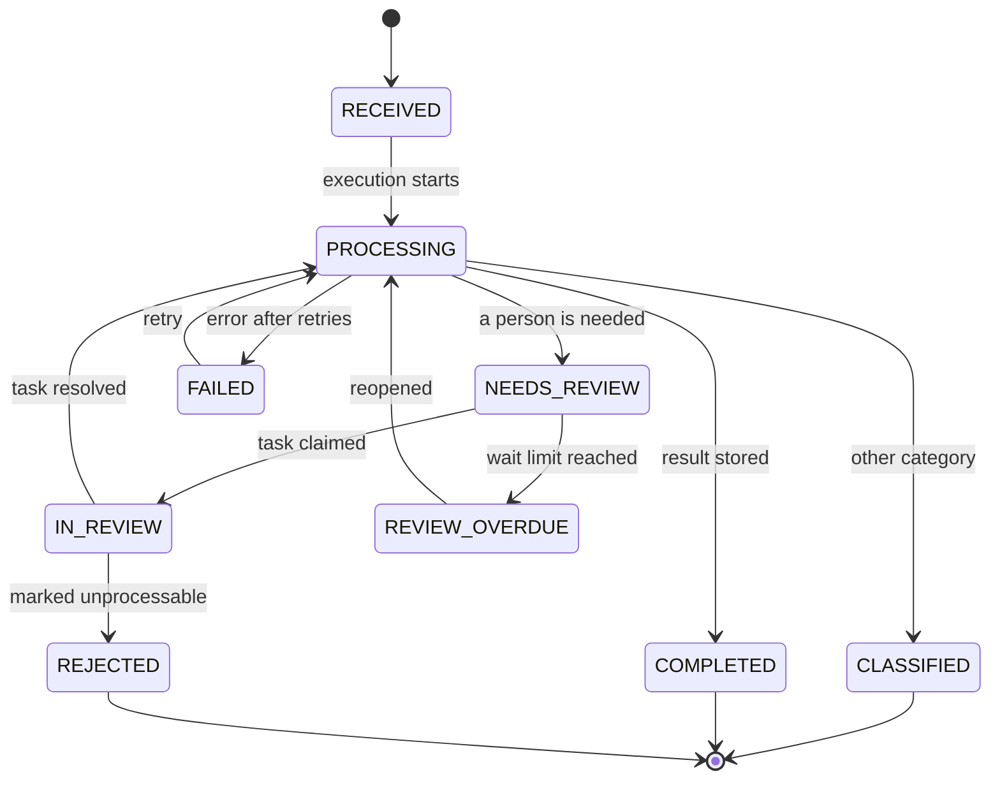

# Software Design Description

**System:** Shipping Document Verification System (SDVS)
**Version:** 1.0 draft for team review
**Date:** 21 September 2026
**Design basis:** [SDVS Software Requirements Specification 1.0](./SRS.md)
**Platform:** AWS, serverless

Serverless design on AWS for the Shipping Document Verification System (SDVS).

## Table of contents

1. [Introduction](#1-introduction)
2. [Architecture](#2-architecture)
3. [Workflow design](#3-workflow-design)
4. [Component design](#4-component-design)
5. [Data design](#5-data-design)
6. [Matching and confidence design](#6-matching-and-confidence-design)
7. [API design](#7-api-design)
8. [Web application design](#8-web-application-design)
9. [Security design](#9-security-design)
10. [Operations](#10-operations)
11. [Testing and evaluation](#11-testing-and-evaluation)
12. [Traceability, risks, and build order](#12-traceability-risks-and-build-order)

---

## 1. Introduction

### 1.1 Purpose and scope

This document describes how the Shipping Document Verification System (SDVS) is built to satisfy the SRS. It covers the architecture, the per-email workflow, each component, the data, the matching rules, the API, the web application, security, operations, testing, and the build order. It targets a hackathon prototype that is lean but complete, and it notes where a production system would go further.

### 1.2 Design goals

These goals are ranked. When two of them conflict, the higher one wins.

1. **Never guess.** A value the system cannot trust goes to a person with evidence.
2. **Few false alarms.** Normalize before comparing, and separate real discrepancies from reading issues.
3. **Visible and recoverable.** Every case ends in a visible state, and every failure can be retried.
4. **Deterministic where it matters.** Comparison is plain code, so results are repeatable and explainable.
5. **Small and cheap.** Serverless and on demand, with the LLM used only where rules are not enough.

### 1.3 Key design decisions

| Area | Decision | Reason |
|---|---|---|
| Orchestration | AWS Step Functions Standard workflow, one execution per email | Shows the history of each case, retries steps, and can pause for a person with a task token |
| Compute | AWS Lambda with Python 3.12 | No servers, scales with the number of emails, and is billed per use |
| Buffering | Amazon SQS with a dead-letter queue between import and processing | Absorbs bursts, isolates bad records, and carries reprocess requests |
| Reading | Direct parsing for text, PDF text layers, and Word. Textract for scans. A Bedrock vision LLM as fallback | The cheapest reliable path comes first and the LLM is used only when needed |
| Extraction | Rules and a synonym dictionary first, then an LLM fallback with a fixed schema and quote verification | Repeatable results, with a guard against invented values |
| Comparison | A deterministic Python module | Explainable, unit-testable, and free of LLM variance |
| Human review | Step Functions callback with a task token | The workflow waits at no cost and resumes exactly where it paused |
| Data | Amazon DynamoDB on demand and Amazon S3 | Simple key access and no servers |
| API | Amazon API Gateway HTTP API with a Cognito JWT authorizer | Managed authentication and throttling |
| Web | Next.js static export on S3 behind CloudFront | No servers, low cost, and fast |
| Authentication | Amazon Cognito user pool with three groups | Managed sign-in, with roles taken from group claims |
| Import | A command-line tool on a team machine that writes to S3 | The cloud cannot reach the local dataset server |
| Infrastructure | AWS CDK in Python | One command to deploy and one to remove |

> **Status of the choices.** The team confirmed orchestration, reading, the web application, and authentication. Infrastructure as code with CDK in Python, the region, and the model selection are proposed defaults that the team can change.

---

## 2. Architecture

### 2.1 Overview

The system has four parts. The importer feeds raw emails into S3. An ingest function turns each email into a case and starts a workflow. The workflow runs Lambda steps that call Textract and Bedrock and store state in DynamoDB. A separate web application and API let people watch the results and answer review tasks.


*Figure 1. Component architecture on AWS.*

### 2.2 AWS services

| Service | Role in SDVS |
|---|---|
| Amazon S3, data bucket | Raw emails and attachments, derived text and OCR output, page images, and exports |
| Amazon S3, web bucket, with Amazon CloudFront | Hosts the static web application over HTTPS |
| Amazon SQS | Ingest queue with a dead-letter queue, also used for reprocess requests |
| AWS Lambda | Every processing step and the API |
| AWS Step Functions | The per-email workflow, retries, and the wait for human review |
| Amazon Textract | OCR, tables, and key-value pairs for scans |
| Amazon Bedrock | Classification, and fallback extraction with vision |
| Amazon DynamoDB | Cases, fields, results, review tasks, audit entries, and configuration |
| Amazon API Gateway, HTTP API | The authenticated API for the web application |
| Amazon Cognito | Users, groups, and sign-in |
| AWS KMS | Encryption keys for S3 and DynamoDB, where AWS managed keys are acceptable |
| Amazon CloudWatch and AWS X-Ray | Logs, metrics, alarms, and traces |
| AWS Systems Manager Parameter Store | Model identifiers and other non-secret settings |
| Amazon SNS, optional | Email notification when a review task is created |
| AWS Budgets | Cost alarm |

### 2.3 Region and environments

The system uses one AWS account, one region, and one environment named `dev`, with an optional demo environment deployed from the same code. Choose the region after checking that Textract and the required Bedrock models are enabled there, and prefer the closest region that offers both. Keeping everything in one region keeps data from crossing regions and keeps latency low.

### 2.4 Repository layout

```
sdvs/
  infra/              AWS CDK app in Python, one stack per concern
  backend/
    functions/        one folder per Lambda (ingest, classify, read_document,
                      extract, compare, review, finalize, api, export)
    shared/           normalizer, comparator, schemas, config loader
    prompts/          versioned LLM prompts and output schemas
  web/                Next.js app in TypeScript
  tools/importer/     Dataset Importer command-line tool
  tests/              unit, contract, workflow tests, and fixture documents
  docs/               SRS and SDD
```

---

## 3. Workflow design

### 3.1 Per-email state machine

Each email runs as one Step Functions Standard execution. Standard is required because only Standard workflows can wait for a task token for days.


*Figure 2. The ProcessEmail state machine. Every task state also has a catch that leads to HandleFailure.*

### 3.2 States

| State | Type | What it does |
|---|---|---|
| `ResumeRouter` | Choice | Jumps to the requested step when a retry resumes from a failure, using artifacts already stored. |
| `ClassifyEmail` | Lambda | Combines quick signals with an LLM decision and stores category, confidence, and reason. |
| `RouteByCategory` | Choice | Sends comparison requests onward, ends other confident categories, and sends uncertain ones to review. |
| `RecordClassifiedOnly` | Lambda | Stores the status Classified and a result of Not applicable. |
| `CreateReviewTask` | Lambda with task token | Creates a review task and pauses the execution until a person resolves it. |
| `ApplyClassificationDecision` | Lambda | Stores the reviewer's category with human confidence and routes again. |
| `PrepareDocuments` | Lambda | Lists attachments and detects their types. Creates a missing attachment review when none exist. |
| `ReadDocuments` | Map, up to 3 in parallel | Reads each attachment into a document representation. |
| `AssignRoles` | Lambda | Decides which document is the SI and which is the BL from content and names. |
| `ExtractFields` | Lambda | Extracts the seven fields from both documents with rules first and the LLM as fallback. |
| `CompareFields` | Lambda | Normalizes and compares fields and computes the field results and the case result. |
| `NeedsReview` | Choice | Goes to review when any field is uncertain or missing. |
| `ApplyResolution` | Lambda | Stores the reviewer's values and loops back to comparison. |
| `FinalizeResult` | Lambda | Stores the result, sets the status, writes the audit entry, and emits metrics. |
| `HandleFailure` | Lambda | Stores the failed step and error, sets the status Failed, and ends the execution as failed. |

### 3.3 Retry and error policy

| Error | Handling |
|---|---|
| Lambda service errors, throttling, and task timeouts | Retry up to 5 times, starting at 2 seconds with a backoff rate of 2 and jitter. |
| Textract or Bedrock throttling | The function converts the SDK error to a retryable error name, and the same retry policy applies. |
| Model output fails the schema | One repair attempt that returns the validation error to the model, then a review with the reason VALIDATION_FAILED. |
| Textract job fails | One retry, then the Bedrock vision fallback for that document. |
| File is corrupt, encrypted, or blank | No retry. A review with the reason UNREADABLE_DOCUMENT. |
| Malformed email record at ingest | No retry. The record is stored as rejected with its reason and the batch continues. |
| Poison message in the ingest queue | Moves to the dead-letter queue after 3 receives, raises an alarm, and shows on the batches screen. |
| Any error after retries | HandleFailure marks the case Failed with the step and message, and an Operator retries from the web application. |

### 3.4 Idempotency and reprocessing

Every function writes to deterministic keys such as the email item, the field items, and the derived files for a document. Running a step again overwrites the same items, so retries never create duplicates. The reprocess API starts a new execution named with the email identifier and a run number. In restart mode it begins at classification. In resume mode it passes the failed step name and the workflow reuses stored artifacts by jumping there.

### 3.5 Human review flow

The review task holds the Step Functions task token on the server side only. The browser never sees the token. When a reviewer submits decisions, the API stores the values and then completes the waiting execution.


*Figure 3. Creating and resolving a review task.*

Three details protect the flow. The resolve call first changes the task status with a conditional update, so two submissions cannot both succeed. If completing the execution fails, the task returns to its previous status and the reviewer sees an error to try again. If the token is no longer valid because the wait limit passed, the case shows Review overdue and an Operator reopens it.

The wait limit is 7 days by default. When it passes, the execution ends through a catch on the timeout, the task and case become overdue, and a reopen starts a new execution that reuses stored artifacts.

### 3.6 Case status lifecycle


*Figure 4. Case statuses and the events that move a case between them.*

---

## 4. Component design

### 4.1 Dataset Importer

A Python command-line tool that runs on a team machine. It uses the provided loader to read either an extracted data folder or the local dataset server, and it uploads everything to the S3 data bucket.

- It writes a batch manifest first, holding the expected number of emails, so the web application can show progress.
- For each email it uploads the attachments first and the email record last. The email record is the commit marker, because its arrival is what triggers processing.
- It skips emails that already exist unless the force option is set, which makes repeated runs safe.
- It uses a named AWS profile with permission limited to the raw prefix of the data bucket.
- It prints a summary of uploaded, skipped, and failed emails and exits with an error code when any upload fails.

If the loader does not return binary attachment content, the importer reads the attachment files directly from the extracted folder or from the server path (open item OI-03).

### 4.2 Ingest function

S3 sends an event to the ingest queue when an object appears under the raw prefix. The ingest Lambda reads messages from the queue and handles two kinds of object.

- **Manifest.** Creates the batch item with the expected count.
- **Email record.** Validates the record against a schema and writes the email item with a conditional put, so an existing email is never overwritten. It then increments the batch counters and starts the ProcessEmail execution with the email identifier, the object keys, and a run number.

A record that fails validation is stored as rejected with its reason and is not retried. A message that fails three times moves to the dead-letter queue. Reprocess requests from the API arrive on the same queue and follow the same path with the run number increased.

Rate limits at Textract and Bedrock are handled by reserved concurrency on the functions that call them and by the step retries, because the queue only controls how fast executions start.

### 4.3 Classify function

Classification uses two signals so that a misleading subject cannot hide a request.

1. **Quick signals from code.** These are the number and names of attachments, keywords in the subject and body, and a short preview of the first 1,000 characters of any attachment that can be read without OCR.
2. **An LLM decision.** A small, fast model on Amazon Bedrock receives the body, the subject as a hint, the sender, the attachment names, and the previews. It answers through a forced tool schema that holds the category, a confidence from 0 to 1, a one-sentence reason, and the signals it used.

The function compares the two signals. When they disagree strongly, for example the LLM says spam while two attachments look like an SI and a BL, it sets the conflicting signals flag and the case goes to review. The category, confidence, reason, and flag are stored on the email item.

### 4.4 Document reading

The read function turns each attachment into one common document representation, whatever the input format.

| Input | Method | Method label |
|---|---|---|
| Plain text | Read as UTF-8 with line numbers | `text` |
| PDF with a text layer | pdfplumber for text and tables, page by page | `text-layer` |
| PDF or image without a usable text layer | Textract AnalyzeDocument with tables and forms. A single page uses the synchronous call and a multi-page PDF uses the asynchronous call, which the function polls for up to 10 minutes | `textract` |
| Word (.docx) | python-docx in document order, with paragraphs and tables | `docx` |
| Word file whose content is only embedded images | Extract the images and treat them as scans | `textract` |
| Anything else, or a file that cannot be opened | Mark the document as unreadable with a reason | `none` |

A PDF is treated as scanned when its text density is below a set number of characters per page. Every PDF page is also rendered to an image with pypdfium2, so the review screen can show the page and highlight the value.

The document representation is saved to S3 and holds these parts.

| Part | Content |
|---|---|
| Pages | Page number, image key, width, and height |
| Lines | Text, page, bounding box when known, and confidence |
| Key-value pairs | Key text, value text, and confidence, from Textract forms |
| Tables | Rows and cells with text and confidence, and the page |
| Method and quality | The method label and the mean confidence of the document |

The AssignRoles step then decides which document is the SI and which is the BL. It searches the text for title phrases such as "Shipping Instruction" and "Bill of Lading", and uses file names as a second signal. If exactly one document is found for each role it proceeds. If one is missing it creates a review with the reason MISSING_ATTACHMENT, and if the answer is unclear or more than two candidates exist it uses UNKNOWN_DOCUMENT_ROLE.

### 4.5 Field extraction

Extraction runs for each document in two stages and keeps the evidence for every value.

1. **Rules.** For each of the seven fields the function looks for candidates in Textract key-value pairs, in table cells whose header or row label matches a synonym, and in text where a label is followed by a value on the same line, the next line, or the cell to the right. Regular expressions handle container numbers and weights. Each candidate receives a confidence based on its source, and disagreeing candidates lower it.
2. **LLM fallback.** The fallback runs for a field only when the value is missing, its confidence is below the threshold, several candidates conflict, or the document was read with low OCR confidence. The model receives the document text with page markers, and page images for scans, and returns through a forced schema. For each field it returns the value, the exact quote it relied on, the page, and the unit, or null when the field is absent.

Every LLM value then passes a verification step. The quote must appear in the document text after whitespace normalization, or in the OCR lines with a fuzzy match of at least 0.9, and the value must appear inside the quote. A value that fails is dropped and the field is recorded as missing. When a low-confidence rule value and a verified LLM value disagree, both are kept as candidates and the field is flagged CONFLICTING_VALUES. When only the LLM produced a verified value, its confidence is capped at 0.9.

Container count follows the rules in SRS requirement EXT-06. It uses an explicit total first, then the sum of quantities such as "3 x 40HC", then the number of distinct container numbers, and it marks derived values. Every stored field item carries the raw text, the normalized value, the confidence, the method, the snippet, the page, the bounding box, and the list of candidates.

### 4.6 Review task manager

The CreateReviewTask function runs as a Step Functions task with the wait-for-token pattern. It writes a task item with the task token, the reason codes, the fields in question with their proposed values and candidates, the evidence pointers, and the email context, then sets the case status to Needs review. Because the token stays on the server, only the API can resume an execution.

A resolution has one of these shapes.

- **Field decisions.** For each field in question the reviewer confirms the value, enters a corrected value, or marks the field as missing, with an optional note.
- **A category decision.** The reviewer sets the category for a classification review.
- **A rejection.** The reviewer marks the case as unprocessable with a required note, and the case ends with the status Rejected.

The ApplyResolution step stores each human value as a field item with the method "human", the reviewer, and the time, keeps the original value in the audit entry, and returns to CompareFields. A case can go through review at most three times. After the third round it ends as Failed with the reason "review limit", so that an Admin looks at it.

### 4.7 Finalize and export

FinalizeResult writes a new version of the result item, sets the case status and result, writes an audit entry, and emits metrics. Result items are versioned, so the history of results before and after review is kept.

The export function builds the submission from the email and result items. It includes an entry for every email in the dataset. For comparison requests it reports the category, whether a mismatch was found, and the differing fields. For other emails it reports the category only. Key names and field identifiers come from the export mapping in configuration, so they can be aligned with `sample_submission.json` without code changes. The function saves the file to the exports prefix, returns a short-lived link, and returns the list of cases still waiting for review so that the web application can warn before download. It can also produce a CSV for people.

---

## 5. Data design

### 5.1 S3 data bucket layout

| Prefix | Content | Retention |
|---|---|---|
| `raw/{batch}/manifest.json` | Expected count for the batch | Project lifetime |
| `raw/{batch}/emails/{email}.json` | The original email record | Project lifetime |
| `raw/{batch}/attachments/{email}/{file}` | The original attachments | Project lifetime |
| `derived/{email}/{doc}/doc.json` | The document representation | 30 days, rebuildable |
| `derived/{email}/{doc}/pages/{n}.png` | Page images for evidence and for the vision fallback | 30 days, rebuildable |
| `exports/{time}.json` and `exports/{time}.csv` | Generated exports | 30 days |

### 5.2 DynamoDB tables

All tables use on-demand capacity and encryption at rest. Point-in-time recovery is on for emails and results.

| Table | Key | Main attributes | Indexes |
|---|---|---|---|
| `batches` | batch_id | Expected, received, accepted, and rejected counts, created time, and source | None |
| `emails` | email_id | batch_id, subject, sender, received time, category, category confidence and reason, status, result, attachments with type and S3 key, execution ARN, run number, failure step and message, and updated time | status-index on status and updated time. batch-index on batch_id and received time |
| `fields` | email_id and sort key of role and field | Raw value, normalized value, confidence, method, snippet, page, bounding box, candidates, derived flag, reviewer, and review time | None |
| `results` | email_id and version | Overall result, per-field results with SI value, BL value, and reason, creation time, and trigger | None |
| `review_tasks` | task_id | email_id, type, reasons, fields in question, proposed values, evidence pointers, status, claimed by, task token (never returned by the API), created and resolved times, and resolution | status-index on status and created time. email-index on email_id |
| `audit` | email_id and sort key of time and identifier | Actor, role, action, and details | date-index on date and time |
| `config` | key | JSON value, updated by, and updated time | None |

The audit table also holds events that belong to no single email, using the partition values CONFIG and IMPORT. The config table holds thresholds, label synonyms, port aliases, company suffixes, and the export mapping.

### 5.3 Entity relationships

```mermaid
erDiagram
  BATCHES ||--o{ EMAILS : contains
  EMAILS ||--o{ FIELDS : has
  EMAILS ||--o{ RESULTS : produces
  EMAILS ||--o{ REVIEW_TASKS : raises
  EMAILS ||--o{ AUDIT : records
  BATCHES {
    string batch_id PK
    number expected
    number received
  }
  EMAILS {
    string email_id PK
    string batch_id FK
    string category
    string status
    string result
  }
  FIELDS {
    string email_id PK
    string role_field PK
    string raw_value
    string normalized_value
    number confidence
    string method
  }
  RESULTS {
    string email_id PK
    number version PK
    string overall_result
  }
  REVIEW_TASKS {
    string task_id PK
    string email_id FK
    string status
    string reasons
  }
  AUDIT {
    string email_id PK
    string sort_key PK
    string actor
    string action
  }
```


*Figure 5. Tables and their keys. Only the main attributes are shown.*

---

## 6. Matching and confidence design

This section holds the rules that decide whether two values are the same. It lives in a shared Python library with no AWS dependency, so that it can be unit-tested locally and reused by the extract and compare steps.

### 6.1 Normalization rules

| Field | Steps |
|---|---|
| Shipper, consignee, notify party | Apply Unicode NFKC and uppercase. Replace the ampersand with AND. Remove punctuation and collapse spaces. Split the address from the name, treating the first line or cell as the name. Map legal suffix forms such as SDN BHD, BERHAD, LTD, LIMITED, PTE LTD, LLC, INC, and GMBH to one canonical suffix through the suffix table. Resolve "same as consignee" on the notify party to the consignee of the same document. Keep "TO ORDER" as its own value. |
| Port of loading, port of discharge | Uppercase and strip punctuation. Remove the words "PORT OF" and "PORT", and any country or state after a comma. Map the result through the alias table to a canonical port, using the UN/LOCODE where known. A name that is not in the table falls back to its normalized text. |
| Container count | Parse digits and number words. Prefer an explicit total. Otherwise sum line quantities such as "3 x 40HC", or count distinct container numbers of the ISO 6346 form. Mark derived values. Treat TEU wording as an ambiguous format. |
| Gross weight | Parse the number with thousands and decimal separators. Convert kg, kgs, MT, tonnes, and lb to kilograms, and keep the original text. Treat a plain "tons" unit, or a number such as 22.000 whose separator is unclear, as an ambiguous format. |

### 6.2 Comparison algorithm

The comparator runs these steps for each of the seven fields and stops at the first step that gives a result.

1. If either side is missing, the field is uncertain with the reason MISSING_FIELD.
2. If either side has a confidence below the field threshold, the field is uncertain with the reason LOW_CONFIDENCE_FIELD.
3. If the normalized values are equal, the field is a match. When the raw texts differ, the result records that it matched after normalization.
4. Decide the fidelity of each side. A side is high fidelity when its method is text, text-layer, docx, or human, or when an OCR or LLM value has a verified source and a confidence at or above the high-fidelity threshold.
5. If both sides are high fidelity, the field is a mismatch.
6. Otherwise measure the difference. For text, use a character similarity ratio. For numbers, count differing digits. When the similarity is at or above the reading-issue threshold, or the digits differ in one position, the field is uncertain with the reason POSSIBLE_READING_ISSUE. In every other case the field is a mismatch.

Ports that both resolve through the alias table are compared by canonical identifier, so they match or mismatch at step 3 or step 5. The case result then follows from the field results.

| Field results | Case result | Report text |
|---|---|---|
| All seven fields match | `NO_MISMATCH` | No mismatch detected |
| At least one mismatch and no uncertain field | `MISMATCH_FOUND` | Mismatched fields with SI and BL values |
| Any uncertain or missing field | `PENDING_REVIEW` | Confirmed mismatches so far, and the fields waiting for a person |

The example from the problem statement runs like this. The SI lists 3 containers and 22,000 kg, and the BL lists 4 containers and 22,000 kg. The weights match at step 3. The container counts differ, both sides are high fidelity when the files are text, so step 5 gives a mismatch. The case result is "Mismatch found", and the report shows the container count with SI 3 and BL 4.

### 6.3 Default thresholds

These values live in the config table and an Admin can change them. Calibrate them on the sample data before the demo.

| Setting | Default | Used for |
|---|---|---|
| Classification confidence | 0.80 | Below this, the email goes to review |
| Field acceptance confidence | 0.85 | Below this, a value is uncertain |
| High-fidelity OCR confidence | 0.98 | At or above this, an OCR value counts as high fidelity |
| Fallback trigger, document confidence | 0.90 | Below this mean confidence, the LLM fallback runs |
| Reading-issue similarity | 0.85 | Slight differences at or above this are uncertain and not mismatches |
| LLM-only value cap | 0.90 | Highest confidence for a value produced only by the LLM |
| Weight tolerance | 0 kg | Allowed difference in kilograms |
| Review wait limit | 7 days | Time before a task becomes overdue |
| Review rounds per case | 3 | Limit before the case ends as failed |

### 6.4 Review reasons and where they arise

| Reason | Raised by | Review type |
|---|---|---|
| `MISSING_ATTACHMENT` | PrepareDocuments or AssignRoles | Fields |
| `UNKNOWN_DOCUMENT_ROLE` | AssignRoles | Fields |
| `UNREADABLE_DOCUMENT` | ReadDocuments | Fields |
| `MISSING_FIELD` | Comparator step 1 | Fields |
| `LOW_CONFIDENCE_FIELD` | Comparator step 2 | Fields |
| `CONFLICTING_VALUES` | Extraction merge | Fields |
| `AMBIGUOUS_FORMAT` | Normalizer | Fields |
| `POSSIBLE_READING_ISSUE` | Comparator step 6 | Fields |
| `VALIDATION_FAILED` | Extraction verification | Fields |
| `LOW_CLASS_CONFIDENCE` | ClassifyEmail | Classification |
| `CONFLICTING_SIGNALS` | ClassifyEmail | Classification |

### 6.5 LLM usage design

- **Two prompts.** One for classification and one for extraction. Both live in the repository with a version number, and the version is stored with each result.
- **Models.** A small, fast model for classification and a vision-capable model for extraction. Model identifiers are held in Parameter Store, and the team selects them after checking access in the chosen region.
- **Determinism.** Temperature is 0, the output length is capped, and output is returned only through a forced tool schema.
- **Untrusted content.** Email and document text sit inside clearly marked sections, and the system prompt states that any instructions inside them are data and must be ignored. The model has no tools other than the output schema, so it cannot act on the system.
- **Validation.** Output is checked against the schema, values are checked against their quotes, and one repair attempt is allowed before the case goes to review.
- **Images.** Page images are resized before they are sent.
- **Privacy.** Logs hold identifiers, timings, and outcomes and never the full email or document text.

---

## 7. API design

The API is an Amazon API Gateway HTTP API with a JWT authorizer that trusts the Cognito user pool. All routes require a valid token. A single Lambda per route group checks the group claim, so authorization lives in code as well as in the interface. List routes return a `nextToken` for paging. Errors return a JSON body with a stable code and a readable message, using codes such as FORBIDDEN, NOT_FOUND, and CONFLICT.

| Route | Roles | Purpose |
|---|---|---|
| `GET /me` | Everyone | Current user and role |
| `GET /dashboard` | Everyone | Counts by category, status, and result, the review queue size, and the failed cases, computed on demand at prototype scale |
| `GET /batches` and `GET /batches/{batchId}` | Everyone | Import batches with expected, received, accepted, and rejected counts |
| `POST /batches/{batchId}/reprocess` | Operator, Admin | Sends every email of a batch back to the ingest queue |
| `GET /emails` | Everyone | Paged list with filters for category, status, result, batch, and text |
| `GET /emails/{emailId}` | Everyone | Case detail with fields, results, timeline, and review history |
| `GET /emails/{emailId}/documents/{docId}/url` | Everyone | Short-lived link to a source file or a page image |
| `POST /emails/{emailId}/reprocess` | Operator, Admin | Starts a new execution in restart or resume mode |
| `GET /review-tasks` | Reviewer, Admin | Tasks filtered by status |
| `GET /review-tasks/{taskId}` | Reviewer, Admin | One task with evidence |
| `POST /review-tasks/{taskId}/claim` | Reviewer, Admin | Claims a task, and returns CONFLICT if someone else holds it |
| `POST /review-tasks/{taskId}/release` | Reviewer, Admin | Releases a claimed task |
| `POST /review-tasks/{taskId}/resolve` | Reviewer, Admin | Submits field decisions, a category decision, or a rejection |
| `POST /exports` | Operator, Admin | Creates a submission file or a CSV, and returns a link and the list of pending cases |
| `GET /exports` | Operator, Admin | Past exports with their recorded scores |
| `PUT /exports/{exportId}/score` | Operator, Admin | Records a score and notes |
| `GET /config` and `PUT /config` | Admin | Thresholds, synonyms, port aliases, suffixes, and the export mapping |
| `GET /audit` | Admin | Audit entries by date and actor |

---

## 8. Web application design

### 8.1 Stack and structure

- Next.js with TypeScript, exported as static files and served from S3 through CloudFront. No server rendering is needed because every page sits behind sign-in.
- Detail pages use query strings such as `/case?id=` and not dynamic route segments, because a static export cannot pre-build pages for identifiers it does not know. A small CloudFront function maps folder paths to their index file.
- Amazon Cognito hosted sign-in with the authorization code flow and PKCE. The application keeps tokens in memory and refreshes them silently.
- TanStack Query for data fetching and caching, with a polling interval on the case list and the review queue.
- Tailwind CSS for styling, with a small shared set of components for status chips, evidence panels, and comparison tables.
- The API address and the Cognito identifiers are written by CDK into a `config.json` file at deploy time, so the application is built once and works in every environment.

### 8.2 Screens

| Route | Screen | Key elements |
|---|---|---|
| `/dashboard` | Dashboard | Counts by category and result, review queue size, failed cases, and the last import batch |
| `/emails` | Inbox report | Table of every email with category, status, and result chips, filters, and text search |
| `/case?id=` | Case detail | Email text, documents, the comparison table with SI and BL side by side, extracted fields with evidence, timeline, and review history |
| `/review` | Review queue | Tasks with reason, age, and claim state |
| `/review-task?id=` | Review task | The review screen described below |
| `/batches` | Import batches | Progress against the expected count, rejected records, and dead-letter messages |
| `/export` | Export | Generate a file, see pending cases, download, and record scores and notes |
| `/admin/config` | Configuration | Thresholds, synonym tables, port aliases, and export mapping |
| `/admin/audit` | Audit log | Filter by actor, action, and date |

### 8.3 Review screen

The review screen puts everything a reviewer needs on one page. The left column holds the email and the reason for review. The middle holds the SI and BL viewers. The right column holds one decision card for each field in question.

```
+-----------------------------------------------------------------+
| Subject, sender, reason codes, task status, claim button         |
+----------------------+-------------------------+----------------+
| Email context        | SI viewer               | Field decision |
| Body and attachments | BL viewer               | cards          |
| Category             | Page image with the     | Proposed value |
|                      | value highlighted, or   | Confidence     |
|                      | text with the snippet   | Source snippet |
|                      | highlighted             | Confirm        |
|                      |                         | Correct        |
|                      |                         | Mark missing   |
+----------------------+-------------------------+----------------+
| Reject case with note                     Submit decisions       |
+-----------------------------------------------------------------+
```

Selecting a decision card scrolls each viewer to the source of that value and highlights it. PDFs and scans show the rendered page image with the bounding box drawn on it. Word and text files show their text with the snippet highlighted. When two candidates exist, the card lists both with their sources so that the reviewer chooses one or types a correction.

### 8.4 Interface rules

- Results and statuses use words such as Mismatch, Match, and Needs review together with color, so that meaning never depends on color alone.
- The comparison table always shows the field, the SI value, and the BL value in that order, and shows the words "No mismatch detected" when everything matches.
- Buttons name their action and the result confirms it in the same words. "Save decisions" produces a message that says the decisions were saved.
- Errors say what happened and what to do next. A failed case shows the failed step, the message, and a Retry button.
- Empty states point to the next action, for example the empty review queue says that no tasks are waiting and shows the count of completed cases.
- Actions that a role cannot use are hidden, and the API refuses them anyway.
- Text from emails and documents is always shown as plain text and never rendered as HTML.

---

## 9. Security design

| Area | Design |
|---|---|
| Authentication | Cognito user pool with hosted sign-in, the authorization code flow with PKCE, and short-lived access tokens. |
| Authorization | Groups Operator, Reviewer, and Admin appear in the group claim of the token. The API Gateway authorizer validates the token and each route handler checks the group. The interface hides actions but never carries the decision. |
| Data protection | S3 buckets block public access, allow TLS only, and use server-side encryption with KMS. DynamoDB encryption at rest is on. Presigned links last 5 minutes and are issued only after a permission check. |
| Web delivery | CloudFront with origin access control, HTTPS only, and response headers for content security policy, HSTS, and frame denial. API CORS allows only the CloudFront domain. |
| IAM | One role per Lambda with resource-level permissions. Bedrock access is limited to the configured model ARNs. Completing a task token is limited to the state machine. Importer credentials are limited to the raw prefix. |
| Untrusted content | Email and document text is data. Prompts mark it as such, the model returns only through a forced schema, output is validated against schema and quotes, the model has no tools that change state, and the interface escapes all text. |
| Secrets | None are stored. Models and AWS services are reached through IAM roles, and non-secret settings sit in Parameter Store. |
| Logging and privacy | Logs hold identifiers, timings, and outcomes and never full email or document text. The sample data is assumed to be non-sensitive, and the design still avoids logging content. |
| Abuse limits | API throttling per route and reserved concurrency on the Textract and Bedrock callers. |
| Supply chain | Pinned dependencies, with an audit step in the build for Python and npm packages. |
| Production roadmap | AWS WAF, private networking, customer-managed keys, single sign-on, retention policies, backup, and disaster recovery. These are out of scope for the prototype. |

---

## 10. Operations

### 10.1 Observability

- **Logs.** Structured JSON logs from AWS Lambda Powertools, carrying the email identifier, the execution identifier, and the step name.
- **Metrics.** Emails per category, review rate, fallback rate, failures by step, and step duration, emitted as custom CloudWatch metrics.
- **Alarms.** Failed executions, any message in the dead-letter queue, Lambda errors, API server errors, and the review queue age.
- **Traces.** AWS X-Ray on the API, the functions, and the state machine.
- **Dashboard.** One CloudWatch dashboard for the demo showing throughput, review rate, and failures.

### 10.2 Deployment

| CDK stack | Contains |
|---|---|
| `data` | The S3 buckets, the DynamoDB tables, and the KMS key |
| `auth` | The Cognito user pool, the three groups, and the app client |
| `pipeline` | The SQS queues, the Lambda functions, the Step Functions state machine, and the pipeline alarms |
| `api` | The API Gateway API, the authorizer, and the API Lambda functions |
| `web` | The web bucket, the CloudFront distribution, and the deployment of the built application with its config file |
| `observability` | The dashboard, the remaining alarms, and the budget |

Deploy everything with `cdk deploy --all` and remove everything with `cdk destroy --all`. Buckets are set to empty themselves on destroy. A seed script creates the three groups and one test user for each role. A pipeline in GitHub Actions is optional and, if used, assumes an AWS role through OpenID Connect and holds no long-lived keys.

### 10.3 Cost control

| Cost driver | Control |
|---|---|
| Textract pages | Only documents without a usable text layer go to Textract. |
| Bedrock tokens | A small model for classification, the extraction LLM only as a fallback, limited input size, and capped output length. |
| Step Functions transitions | A compact state machine, with the Map limited to two files. |
| Lambda | Memory tuned per function and reserved concurrency to cap spend. |
| DynamoDB and S3 | On-demand capacity and lifecycle rules that expire rebuildable files after 30 days. |
| Overall | An AWS Budgets alarm at an amount the team sets. Check current prices in the AWS Pricing Calculator before the demo. |

---

## 11. Testing and evaluation

| Level | What is tested | Tools |
|---|---|---|
| Unit | Normalizer rules, number and unit parsing, label synonyms, and every comparator step. Table-driven cases include each acceptance scenario from AC-01 to AC-05. | pytest |
| Extraction | Each sample document against golden values that the team writes | pytest with fixture files |
| Contract | LLM output schemas, API request and response shapes, and the export | pytest with JSON Schema |
| Workflow | The full path in the dev stack with seeded emails, checking execution history and stored results | pytest with boto3, and moto for local AWS mocks |
| Failure injection | A corrupt PDF, a missing attachment, forced Bedrock throttling, a Lambda timeout, and invalid model output, switched on by configuration flags | pytest against the dev stack |
| Interface | Sign-in, the review flow, retry, and role restrictions | Playwright |

### 11.1 Evaluation loop

The team repeats this loop after every significant change. The scoreboard is a guide and not the final judgment, so a difference from the reference triggers a check of the source documents before any change to the system.

1. Import the full dataset into the dev stack.
2. Resolve the open review tasks, or note them.
3. Generate the submission file from the Export screen.
4. Submit the file from a local machine through the loader or the submit endpoint.
5. Open the source documents for each difference.
6. Fix the code, or record the reason the team disagrees with the reference, using the score notes.
7. Add the case to the regression fixtures.

---

## 12. Traceability, risks, and build order

### 12.1 Requirements to components

| SRS group | Main components | Design sections |
|---|---|---|
| Ingestion (ING) | Importer, ingest function, SQS, batches table | 4.1, 4.2 |
| Classification (CLS) | Classify function, review manager | 4.3, 6.5 |
| Document reading (DOC) | Read function, AssignRoles, Textract, Bedrock | 4.4 |
| Extraction (EXT) | Extract function, LLM verification | 4.5, 6.5 |
| Normalization and comparison (NRM, CMP) | Shared normalizer and comparator, config table | 6.1, 6.2, 6.3 |
| Human review (HIL) | CreateReviewTask, ApplyResolution, review API, review screen | 3.5, 4.6, 8.3 |
| Reporting (RPT) | API, emails and results tables, web screens | 7, 8 |
| Failure handling (ERR) | Step retries and catches, HandleFailure, dead-letter queue, reprocess API | 3.3, 3.4, 10.1 |
| Access control (SEC) | Cognito, authorizer, IAM, S3 policies | 9 |
| Export (EVL) | Export function, exports API | 4.7, 7 |
| Non-functional (NFR) | Observability, CDK, tests, budget | 10, 11 |

### 12.2 Risks

| Risk | Impact | Mitigation |
|---|---|---|
| Bedrock or Textract quotas or region availability | Scans and fallback are blocked | Check access and quotas in the first week, choose the region by availability, and use retries with reserved concurrency. |
| OCR misreads a digit | A wrong weight or count is reported | Small differences become uncertain, numeric OCR needs a high threshold, and the fallback cross-checks low-confidence values. |
| Formatting variance causes false alarms | Users lose trust in the report | Build the normalizer from the sample data, unit-test every variance, and keep the alias tables editable. |
| Misleading subjects or attachment names | A request is missed | Use the body and attachment previews, and send conflicting signals to review. |
| Unknown dataset details | Rework in the importer or export | Confirm the open items in SRS section 9 before coding the importer and the export. |
| Too many review tasks | The demo slows down | Tune thresholds on the sample data and watch the review rate metric. |
| Unfamiliar serverless tooling | Delay | Build a thin vertical slice first and deploy it early. |
| Limited time | Scope falls short | Follow the build order and drop Could items first. |

### 12.3 Build order

| Phase | Goal | Done when |
|---|---|---|
| Phase 1 | A thin vertical slice on plain text. Importer, ingest, classify, extract, compare, and a basic report in the web application, deployed to the dev stack. | A few emails run from import to a visible report, and the first submission is scored. |
| Phase 2 | Advanced readers. PDF, Word, Textract, the Bedrock fallback, and quote verification. | Scans and label variants pass, and the acceptance scenarios AC-03 to AC-05 and AC-09 to AC-10 pass. |
| Phase 3 | Reliability and review. Confidence rules, review tasks, resume after review, retries, and failure states. | The demo cases for unreadable, missing, and corrupt inputs behave as specified. |
| Phase 4 | Hardening and demo. Metrics, alarms, admin configuration, tests, the evaluation loop, and the demo script. | A full dataset run is scored and every acceptance scenario passes. |

---

*SDVS Software Design Description, version 1.0 draft, 21 September 2026.*
