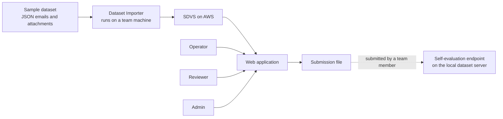
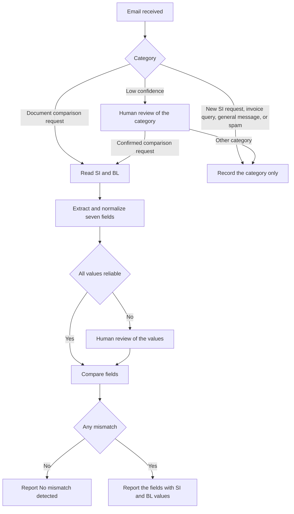

# Software Requirements Specification

**System:** Shipping Document Verification System (SDVS)
**Version:** 1.0 draft for team review
**Date:** 21 September 2026
**Target level:** Hackathon prototype, lean but complete
**Companion document:** [Software Design Description](./SDD.md)

SDVS. From email inbox to discrepancy report, built on AWS.

## Table of contents

1. [Introduction](#1-introduction)
2. [Overall description](#2-overall-description)
3. [Functional requirements](#3-functional-requirements)
4. [External interface requirements](#4-external-interface-requirements)
5. [Non-functional requirements](#5-non-functional-requirements)
6. [Data requirements](#6-data-requirements)
7. [Business rules](#7-business-rules)
8. [Acceptance criteria](#8-acceptance-criteria)
9. [Open items to confirm](#9-open-items-to-confirm)

---

## 1. Introduction

### 1.1 Purpose

This document states what the Shipping Document Verification System (SDVS) must do and the qualities it must have. It turns the organizers' problem statement into requirements that the team can build, test, and demonstrate. The companion Software Design Description explains how these requirements are met on AWS.

The readers are the engineers who build the system, the project manager who tracks it, and anyone who reviews or tests the prototype.

### 1.2 Scope

SDVS reads a shipping operations inbox and classifies every message. For each document-comparison request it extracts seven fields from a Shipping Instruction (SI) and a draft Bill of Lading (BL), compares them, and reports every mismatch with both values side by side. When it cannot decide reliably, it sends the case to a person with the evidence and continues once the person answers.

**In scope**
- Classification of every email into five categories
- Extraction and comparison of seven fields
- Plain text, PDF, Word, and scanned attachments
- Human review with evidence, and a report update after review
- Visible failures with retry
- A web application with role-based access
- An export file for the self-evaluation endpoint
- Hosting on AWS with a serverless design

**Out of scope**
- Live mailbox connections such as Amazon SES, IMAP, or Gmail
- Replying to emails, preparing new SIs, or answering invoice queries
- Editing or finalizing the BL itself
- Multi-tenant use and company single sign-on
- Production disaster recovery and formal compliance certification
- Languages other than English

### 1.3 Definitions and abbreviations

| Term | Meaning |
|---|---|
| SI | Shipping Instruction. The document that states the intended shipment details. It is the reference for every check. |
| BL | Bill of Lading. The draft document that is checked against the SI. |
| Case | One inbox email together with its attachments, classification, extracted values, results, and history. |
| Mismatch | A difference between the SI value and the BL value of one of the seven fields that remains after formatting differences are removed. |
| Formatting difference | A difference in spelling, case, punctuation, label, unit, or layout that does not change the meaning of a value. |
| Reading issue | A difference caused by imperfect OCR or extraction and not by the documents themselves. |
| Human in the loop | A person reviews a case that the system cannot decide, and the workflow resumes with the person's answer. |
| Review task | A unit of work for a reviewer, created when a case needs a person. |
| OCR | Optical character recognition, which reads text from images and scans. |
| Amazon Textract | The AWS service that performs OCR and also returns tables and key-value pairs. |
| Amazon Bedrock | The AWS service that gives access to large language models. |
| LLM | Large language model. |
| Confidence | A score from 0 to 1 that states how sure the system is about a classification or an extracted value. |
| TEU | Twenty-foot equivalent unit. A capacity measure that is not the same as a container count. |
| Self-evaluation | The optional endpoint on the local dataset server that scores a submitted result against a private reference. |

### 1.4 References

- Problem statement, "Shipping document verification. From email inbox to discrepancy report" (organizers).
- Participant guide, `loader.py`, and `sample_submission.json` (organizers, supplied with the dataset).
- SDVS Software Design Description (companion document).

> **Note.** The participant guide, loader, sample data, and sample submission file were not available when this draft was written. Requirements that depend on them are listed as open items in section 9, with the default that this draft uses until each item is confirmed.

### 1.5 Conventions

Requirements use the word *shall*. Every statement has an identifier, and every functional requirement carries a priority and a stage.

| Label | Meaning |
|---|---|
| `FR-ING-01` | Functional requirement. The middle part names the group and the last part is the number. |
| `NFR-PRF-01` | Non-functional requirement. |
| `BR-01` | Business rule. |
| `AC-01` | Acceptance criterion. |
| `OI-01` | Open item that needs confirmation. |
| `C-1` and `A-1` | Constraint and assumption. |
| **Must** | Needed for the prototype to be accepted. |
| **Should** | Expected, and dropped only under time pressure. |
| **Could** | Optional. |
| Basic | Belongs to the basic stage of the problem statement, which uses plain-text attachments. |
| Advanced | Belongs to the advanced stage, which adds PDF, Word, scans, messy inputs, human review, and reliability. |

---

## 2. Overall description

### 2.1 Product perspective

SDVS is a new, standalone system. Emails enter through a Dataset Importer that reads the sample dataset on a team machine and uploads it to AWS. Everything after that runs in the cloud. The self-evaluation endpoint lives on the local dataset server, which the cloud cannot reach, so SDVS produces a submission file and a team member submits it from a local machine.

*Figure 1. System context. Solid arrows are automatic and the last arrow is a manual step by a team member.*

### 2.2 Product functions

- Classify every email as a document comparison request, a new SI request, an invoice query, a general message, or spam.
- Read SI and BL attachments in plain text, PDF, Word, and scanned form.
- Extract and normalize seven fields, recognizing different labels for the same field.
- Compare the fields and report each mismatch with the SI and BL values side by side.
- Escalate uncertain cases to a person with evidence, then resume and update the report.
- Show failures visibly and allow retries.
- Control access by role and keep an audit trail.
- Export the results in the shape needed by the self-evaluation endpoint.

*Figure 2. Business flow for one email. Review can also happen after classification, and the case then follows the path the reviewer confirms.*

### 2.3 User classes

| Role | Who | Main tasks |
|---|---|---|
| Operator | Shipping operations staff | View the report and case details, reprocess or retry cases, and export results. |
| Reviewer | Documentation specialist who can decide on uncertain values | View everything an Operator views, claim and resolve review tasks, correct extracted values, and change categories. |
| Admin | Project team lead | Do everything a Reviewer and an Operator can do, manage users and roles, adjust thresholds and matching tables, and read the audit log. |

### 2.4 Operating environment

- The system runs on AWS in one region, using managed and serverless services only.
- The web application supports the latest two versions of Chrome, Edge, Firefox, and Safari on desktop and tablet, with a readable layout on phones.
- The Dataset Importer runs on Windows, macOS, or Linux with Python and AWS credentials.

### 2.5 Design and implementation constraints

| ID | Constraint | Source |
|---|---|---|
| `C-1` | All cloud infrastructure runs on AWS. | Team decision |
| `C-2` | Orchestration uses AWS Lambda, AWS Step Functions, and Amazon SQS. | Team decision |
| `C-3` | Documents are read with Amazon Textract first, with an Amazon Bedrock LLM as fallback. | Team decision |
| `C-4` | The interface is a full web application built with React or Next.js. | Team decision |
| `C-5` | Users sign in through Amazon Cognito and hold one of three roles. | Team decision |
| `C-6` | The only email source is the sample dataset, read through the provided loader from a data folder or the local server. | Team decision |
| `C-7` | The SI is the reference, and exactly seven fields are compared. | Problem statement |
| `C-8` | The self-evaluation output is one JSON object keyed by `email_id`, following `sample_submission.json`. | Problem statement |

### 2.6 Assumptions and dependencies

| ID | Assumption |
|---|---|
| `A-1` | The dataset follows the participant guide, with email records in JSON that reference SI and BL attachments by path. |
| `A-2` | Each comparison request refers to one SI and one BL. If more are found, the case goes to review. |
| `A-3` | Documents are written in English. |
| `A-4` | Amazon Textract and a vision-capable Amazon Bedrock model are available and enabled in the chosen AWS region. |
| `A-5` | The sample data is synthetic or non-sensitive, so it may be processed by AWS managed AI services. |
| `A-6` | The team has an AWS account with permission to create the required resources. |
| `A-7` | The loader gives access to attachment content for PDF and Word files, or the files can be read directly from the extracted data folder. |

---

## 3. Functional requirements

Each row is a statement the system shall satisfy. The priority column shows how important it is, and the stage column shows which stage of the problem statement needs it.

### 3.1 Email ingestion

| ID | Requirement | Priority | Stage |
|---|---|---|---|
| `FR-ING-01` | The system shall import email records and their attachments from the sample dataset, from either an extracted data folder or the local dataset server, using the provided loader. | Must | Basic |
| `FR-ING-02` | The importer shall upload each email and its attachments to AWS, and the system shall create one case per email. | Must | Basic |
| `FR-ING-03` | Importing shall be idempotent. Importing an email that already exists shall not create a duplicate case and shall not restart processing unless reprocessing is requested. | Must | Basic |
| `FR-ING-04` | The system shall reject a malformed email record with a visible reason and shall continue with the remaining emails. | Must | Basic |
| `FR-ING-05` | The system shall track each import as a batch with counts of emails expected, received, accepted, and rejected. | Should | Basic |
| `FR-ING-06` | An authorized user shall be able to reprocess one email or a whole batch. | Should | Basic |

### 3.2 Email classification

| ID | Requirement | Priority | Stage |
|---|---|---|---|
| `FR-CLS-01` | The system shall assign exactly one category to every email from document comparison request, new SI request, invoice query, general message, and spam. | Must | Basic |
| `FR-CLS-02` | The decision shall use the subject, body, sender, and the presence and content of attachments. It shall not rely on the subject alone. | Must | Advanced |
| `FR-CLS-03` | The system shall store the category, a confidence score, and a short reason for every email. | Must | Basic |
| `FR-CLS-04` | Only emails classified as document comparison requests shall continue to extraction and comparison. All other categories shall end at classification with the status recorded. | Must | Basic |
| `FR-CLS-05` | The system shall send an email to review when classification confidence is below the threshold or when signals conflict, for example a subject that asks for a check but no attachments. | Must | Advanced |
| `FR-CLS-06` | A reviewer shall be able to correct the category, and the case shall then continue along the path for the corrected category. | Should | Advanced |

### 3.3 Document reading

| ID | Requirement | Priority | Stage |
|---|---|---|---|
| `FR-DOC-01` | The system shall identify which attachment is the SI and which is the BL, using content first and file name second. If it cannot decide, it shall create a review task. | Must | Basic |
| `FR-DOC-02` | The system shall read plain-text attachments. | Must | Basic |
| `FR-DOC-03` | The system shall read PDFs that contain a text layer, including tables and multi-column layouts. | Must | Advanced |
| `FR-DOC-04` | The system shall read Word (.docx) documents, including tables. | Must | Advanced |
| `FR-DOC-05` | The system shall read image-only PDFs and scanned pages by using Amazon Textract first. | Must | Advanced |
| `FR-DOC-06` | The system shall fall back to an Amazon Bedrock LLM with vision when Textract returns nothing usable, returns low confidence, or lacks a required field. | Must | Advanced |
| `FR-DOC-07` | The system shall detect unreadable input such as corrupt, encrypted, blank, or unsupported files, and shall create a review task with the reason. | Must | Advanced |
| `FR-DOC-08` | The system shall keep the source file, the extracted text, and the location of every value in the document as evidence. | Must | Basic |

### 3.4 Field extraction

| ID | Requirement | Priority | Stage |
|---|---|---|---|
| `FR-EXT-01` | The system shall extract shipper, consignee, notify party, port of loading, port of discharge, container count, and gross weight in kilograms from both documents. | Must | Basic |
| `FR-EXT-02` | The system shall treat different labels for the same field as that field, for example Port of Loading, Load Port, and POL. | Must | Basic |
| `FR-EXT-03` | For every extracted value the system shall store the raw text, the normalized value, a confidence score, the method used (rule, Textract, LLM, or human), and the source snippet with its page. | Must | Basic |
| `FR-EXT-04` | A value that is not present in a document shall be recorded as missing. The system shall never invent or guess a value. | Must | Basic |
| `FR-EXT-05` | LLM output shall follow a fixed schema, and a value shall be accepted only when its supporting quote is found in the document text or the OCR output. | Must | Advanced |
| `FR-EXT-06` | Container count shall come from an explicit total when one is present. Otherwise it shall be derived from container quantities or from the list of container numbers and marked as derived. When an explicit total and a derived count disagree, the system shall create a review task. | Must | Advanced |
| `FR-EXT-07` | When a document holds several weights, the system shall choose the gross weight by its label. If the label is unclear, the system shall create a review task. | Should | Advanced |
| `FR-EXT-08` | When a notify party is stated as the same as the consignee, the system shall resolve it to that document's consignee before comparing. | Should | Advanced |

### 3.5 Normalization

| ID | Requirement | Priority | Stage |
|---|---|---|---|
| `FR-NRM-01` | Party names shall be compared after normalization of case, spacing, punctuation, the ampersand and the word "and", line breaks, and common company suffix forms such as Sdn Bhd, Sdn. Bhd., Ltd, and Limited. | Must | Basic |
| `FR-NRM-02` | Address lines that follow a party name shall be separated from the name. Address differences alone shall not be reported as a mismatch and shall be shown as a note on the case. | Should | Advanced |
| `FR-NRM-03` | Ports shall be normalized through an alias table that maps names, spellings, and UN/LOCODE codes to one canonical port, ignoring country suffixes and words such as "Port of". | Must | Basic |
| `FR-NRM-04` | Container count shall be an integer number of containers and not TEU. Numbers written in words shall be converted. An unclear count unit shall create a review task. | Must | Basic |
| `FR-NRM-05` | Gross weight shall be converted to kilograms from kg, kgs, MT, tonnes, and lb, with thousands separators and decimal formats handled. An ambiguous unit such as "tons", or an ambiguous number format, shall create a review task. | Must | Basic |
| `FR-NRM-06` | An Admin shall be able to change label synonyms, port aliases, and company suffixes without redeploying the system. | Could | Advanced |

### 3.6 Comparison

| ID | Requirement | Priority | Stage |
|---|---|---|---|
| `FR-CMP-01` | The system shall compare the seven fields between the SI (the reference) and the BL for every comparison request. | Must | Basic |
| `FR-CMP-02` | Each field shall receive one result, which is match, mismatch, or uncertain. | Must | Basic |
| `FR-CMP-03` | A difference that disappears after normalization shall not be a mismatch. The case may record that the field matched after normalization. | Must | Basic |
| `FR-CMP-04` | Values that differ after normalization and that both come from high-fidelity sources (plain text, PDF text layer, Word, or OCR with high confidence) shall be a mismatch. | Must | Advanced |
| `FR-CMP-05` | Values that differ slightly after normalization, when either one comes from OCR or an LLM with limited confidence, shall be uncertain because the cause may be a reading issue. | Must | Advanced |
| `FR-CMP-06` | The system shall show every mismatch with the field name and the SI value and BL value side by side. | Must | Basic |
| `FR-CMP-07` | The case result shall be "No mismatch detected" when all seven fields match, "Mismatch found" when at least one field mismatches and none is uncertain, and "Needs review" when any field is uncertain or missing. | Must | Basic |
| `FR-CMP-08` | Comparison shall be deterministic. The same values shall always give the same result, and an LLM shall not make the comparison decision. | Must | Basic |
| `FR-CMP-09` | The system shall never change the SI. A reviewer may correct how a value was read but not the source document. | Must | Basic |

### 3.7 Escalation and human review

| ID | Requirement | Priority | Stage |
|---|---|---|---|
| `FR-HIL-01` | The system shall create a review task when a document is unreadable, an attachment is missing, a required value is missing, confidence is low, values conflict, a unit is ambiguous, classification is uncertain, or LLM output fails validation. | Must | Advanced |
| `FR-HIL-02` | A review task shall show the email context, the reason, the affected fields, the proposed values, and the source evidence next to each value. | Must | Advanced |
| `FR-HIL-03` | A reviewer shall be able to confirm a value, correct a value, mark a value as missing, change the category, or reject the case as unprocessable with a note. | Must | Advanced |
| `FR-HIL-04` | After a task is resolved, the workflow shall resume, the comparison shall run again with the confirmed values, and the report shall update. | Must | Advanced |
| `FR-HIL-05` | The system shall record who resolved the task, when, and the original and final values. | Must | Advanced |
| `FR-HIL-06` | A reviewer shall be able to claim a task so that two people do not work on it at the same time, and to release it. | Should | Advanced |
| `FR-HIL-07` | A task that waits longer than the wait limit shall show a visible Overdue state and shall not fail silently. | Should | Advanced |
| `FR-HIL-08` | The system shall show the number of open review tasks to reviewers and may notify them by email. | Could | Advanced |

### 3.8 Reporting

| ID | Requirement | Priority | Stage |
|---|---|---|---|
| `FR-RPT-01` | The report shall list every email in the dataset with its category and status. | Must | Basic |
| `FR-RPT-02` | For each comparison request, the report shall show whether it was checked, the case result, and the mismatched fields with SI and BL values. | Must | Basic |
| `FR-RPT-03` | Users shall be able to filter and search by category, status, result, and text. | Should | Basic |
| `FR-RPT-04` | A case detail page shall show the email, the documents, the extracted fields with evidence, the comparison table, the processing timeline, and the review history. | Must | Basic |
| `FR-RPT-05` | A dashboard shall show counts by category and result, the size of the review queue, and the number of failed cases. | Should | Basic |
| `FR-RPT-06` | Users shall be able to open the source documents from the case page through short-lived links. | Must | Advanced |

### 3.9 Failure handling and retry

| ID | Requirement | Priority | Stage |
|---|---|---|---|
| `FR-ERR-01` | Every processing failure shall be visible on the case with the failed step and a readable message. | Must | Advanced |
| `FR-ERR-02` | Transient errors such as throttling and timeouts shall be retried automatically with backoff before the case is marked failed. | Must | Advanced |
| `FR-ERR-03` | An Operator shall be able to retry a failed case, either from the failed step or from the start. | Must | Advanced |
| `FR-ERR-04` | A failure in one case shall not stop other cases. | Must | Basic |
| `FR-ERR-05` | Messages that exhaust their retries shall move to a dead-letter queue, and the related case shall show as failed. | Must | Advanced |
| `FR-ERR-06` | Every email shall always end in a visible state. The system shall never drop an email silently or report a result it could not compute. | Must | Basic |

### 3.10 Access control and audit

| ID | Requirement | Priority | Stage |
|---|---|---|---|
| `FR-SEC-01` | Users shall sign in with Amazon Cognito. Unauthenticated requests shall be refused. | Must | Basic |
| `FR-SEC-02` | Access shall follow the permission matrix in section 3.13. | Must | Basic |
| `FR-SEC-03` | Source documents shall be reachable only through short-lived links issued to signed-in users who have permission. | Must | Basic |
| `FR-SEC-04` | The system shall write an audit entry for imports, reprocessing, reviews, configuration changes, and exports. | Must | Advanced |

### 3.11 Export and evaluation

| ID | Requirement | Priority | Stage |
|---|---|---|---|
| `FR-EVL-01` | The system shall generate one JSON object keyed by `email_id` that includes every email in the dataset and follows `sample_submission.json`. For document comparison requests it shall report the category, whether a mismatch was found, and the fields that differ. | Must | Basic |
| `FR-EVL-02` | Field identifiers in the export shall follow the names used in `sample_submission.json` through a mapping that can be changed. | Must | Basic |
| `FR-EVL-03` | Before an export, the system shall warn when cases are still waiting for review and shall list them. | Should | Advanced |
| `FR-EVL-04` | The team shall be able to record the score and notes for each submission, including the reason when the team disagrees with the reference after checking the source documents. | Could | Basic |

### 3.12 Administration

| ID | Requirement | Priority | Stage |
|---|---|---|---|
| `FR-ADM-01` | An Admin shall be able to change confidence thresholds and the weight tolerance. The default tolerance is zero. | Should | Advanced |
| `FR-ADM-02` | An Admin shall be able to add users and assign roles, through the web application or the Amazon Cognito console. | Must | Basic |

### 3.13 Permission matrix

Imports run from a team machine with AWS credentials and sit outside this matrix.

| Capability | Operator | Reviewer | Admin |
|---|---|---|---|
| View the report, dashboard, cases, and documents | Yes | Yes | Yes |
| Reprocess or retry a case | Yes | No | Yes |
| Claim and resolve review tasks | No | Yes | Yes |
| Generate exports and record scores | Yes | No | Yes |
| Change configuration | No | No | Yes |
| Manage users and roles | No | No | Yes |
| Read the audit log | No | No | Yes |

---

## 4. External interface requirements

### 4.1 User interface

| Screen | Purpose | Roles |
|---|---|---|
| Sign in | Amazon Cognito hosted sign-in | Everyone |
| Dashboard | Counts by category and result, review queue size, failed cases | Everyone |
| Inbox report | Every email with category, status, and result, with filters and search | Everyone |
| Case detail | Email, documents, fields with evidence, comparison table, timeline, and review history | Everyone |
| Review queue | Open, claimed, and overdue review tasks | Reviewer, Admin |
| Review task | Side-by-side evidence and a value editor | Reviewer, Admin |
| Import batches | Batch counts, rejected records, and failures | Operator, Admin |
| Export | Generate the submission file and a CSV, and record scores | Operator, Admin |
| Configuration | Thresholds, synonyms, port aliases, and export mapping | Admin |
| Audit log | Actions by user and time | Admin |

The interface shall meet these rules.

- Status and results are shown with words as well as color.
- Evidence appears next to each value so that a reviewer does not need to open the source file separately.
- Every action can be done with the keyboard.
- Error messages say what happened and what the person can do next.

### 4.2 Software interfaces

| Interface | Direction | Purpose |
|---|---|---|
| Dataset loader (`loader.py`) | Read | Provides email records and attachment content from a data folder or the local server. |
| Self-evaluation endpoint (`POST /submit` on the local server) | Written by a team member | Scores a submission and returns the scoreboard. |
| Amazon S3 | Read and write | Stores raw and derived files. |
| Amazon Textract | Call | OCR, tables, and key-value pairs for scanned documents. |
| Amazon Bedrock | Call | Classification and fallback extraction with an LLM. |
| Amazon Cognito | Call | Sign-in, users, and roles. |
| Web API over HTTPS | Called by the web application | Cases, review tasks, exports, and configuration. The routes are listed in the SDD. |

### 4.3 Communications

All traffic uses HTTPS with TLS 1.2 or higher. The API accepts browser requests only from the web application's origin.

---

## 5. Non-functional requirements

The numeric targets are starting values for the prototype. The team calibrates them against the sample data and the self-evaluation results.

| ID | Quality | Requirement | How it is measured |
|---|---|---|---|
| `NFR-PRF-01` | Performance | Classification of one email is fast enough for interactive use. | 95th percentile under 30 seconds |
| `NFR-PRF-02` | Performance | A comparison case that needs no review completes promptly. | 95th percentile under 2 minutes for text and text-layer files, and under 5 minutes for multi-page scans |
| `NFR-PRF-03` | Performance | The whole sample dataset finishes its automated stages without manual work. | Under 30 minutes, with dataset size to be confirmed |
| `NFR-PRF-04` | Performance | List pages in the web application load quickly. | First results shown within 2 seconds on a normal connection |
| `NFR-ACC-01` | Accuracy | Classification is correct on the sample data. | At least 95 percent correct in self-evaluation |
| `NFR-ACC-02` | Accuracy | The system creates few false alarms. | Fewer than 2 percent of matching fields reported as mismatches |
| `NFR-ACC-03` | Accuracy | Real discrepancies are found. | At least 95 percent of reference mismatches reported or sent to review |
| `NFR-ACC-04` | Accuracy | No value is fabricated. | Every extracted value traces to a source snippet, 100 percent |
| `NFR-REL-01` | Reliability | No email is lost. | The number of cases equals the number of emails, and every case ends in a visible state |
| `NFR-REL-02` | Reliability | Processing steps are safe to repeat. | Re-running any step gives the same stored result and creates no duplicates |
| `NFR-REL-03` | Reliability | A failed case recovers without manual data repair. | Recovery from the web application with one action |
| `NFR-SEC-01` | Security | Data is encrypted at rest and in transit. | Encryption enabled on all buckets and tables, and HTTPS only |
| `NFR-SEC-02` | Security | Each component has only the access it needs. | One role per function with resource-level permissions |
| `NFR-SEC-03` | Security | Email and document text is treated as untrusted data. | Text inside a document cannot change system behavior, LLM output is schema-validated, and the LLM has no tools that act on the system |
| `NFR-SEC-04` | Security | No public data and no secrets in code. | Buckets block public access, and the repository holds no keys |
| `NFR-USA-01` | Usability | A reviewer resolves a task without leaving the page. | A typical task is resolved in under 2 minutes |
| `NFR-USA-02` | Usability | The interface is accessible. | Keyboard operable, text contrast meets WCAG 2.1 AA, and status is never shown by color alone |
| `NFR-OBS-01` | Observability | A case can be traced from end to end. | Logs carry the email and execution identifiers, with alarms for failures and the dead-letter queue |
| `NFR-MNT-01` | Maintainability | Deployment is reproducible. | One command deploys and one command removes the stack, with all infrastructure defined as code |
| `NFR-MNT-02` | Maintainability | Core logic is testable without AWS. | The normalizer and comparator have unit tests that run locally |
| `NFR-CST-01` | Cost | Spend stays within the team budget. | A budget alarm is set, the LLM is used only as a fallback for extraction, and billing is on demand |

---

## 6. Data requirements

### 6.1 Email categories

| Category | Meaning | What SDVS does |
|---|---|---|
| Document comparison request | Asks the team to check an SI against a draft BL | Reads, extracts, compares, and reports |
| New SI request | Asks the team to prepare new shipping instructions | Records the category only |
| Invoice query | Asks a question about an invoice | Records the category only |
| General message | Operational updates and other messages | Records the category only |
| Spam | Unwanted or irrelevant message | Records the category only |

### 6.2 The seven fields

The label variants are typical examples. The final dictionary is built from the sample data.

| Field | Typical labels | Normalization | Comparison rule |
|---|---|---|---|
| Shipper | Shipper, Exporter, Consignor | Case, punctuation, and company suffixes, with the name separated from the address | Equal after normalization |
| Consignee | Consignee, Receiver, Importer | Same as shipper. "To order" is kept as its own value | Equal after normalization |
| Notify party | Notify, Notify party, Also notify | Same as shipper, and "same as consignee" is resolved | Equal after normalization |
| Port of loading | Port of loading, Load port, POL | Alias table by name or UN/LOCODE | Same canonical port |
| Port of discharge | Port of discharge, Discharge port, POD | Alias table by name or UN/LOCODE | Same canonical port |
| Container count | Number of containers, Containers, Quantity lines | Integer, words converted to numbers, derived from lists when no total exists | Equal integers |
| Gross weight (kg) | Gross weight, G.W., Gross wt | Converted to kilograms, separators handled | Equal within the tolerance, which is zero by default |

### 6.3 Case statuses

| Status | Meaning |
|---|---|
| `RECEIVED` | The email is stored and waiting to be processed. |
| `PROCESSING` | A workflow execution is running. |
| `CLASSIFIED` | The email is not a comparison request and processing is complete. |
| `NEEDS_REVIEW` | A review task is open and waiting for a reviewer. |
| `IN_REVIEW` | A reviewer has claimed the task. |
| `REVIEW_OVERDUE` | A review task waited longer than the wait limit. |
| `COMPLETED` | A result is stored. |
| `REJECTED` | A reviewer marked the case as unprocessable. |
| `FAILED` | A step failed after retries and the case waits for a retry. |

### 6.4 Case results

| Result | Meaning |
|---|---|
| `NO_MISMATCH` | All seven fields match. The report says "No mismatch detected". |
| `MISMATCH_FOUND` | At least one field mismatches and none is uncertain. |
| `PENDING_REVIEW` | At least one field is uncertain or missing and a person must decide. |
| `NOT_APPLICABLE` | The email is not a comparison request. |
| `UNAVAILABLE` | No result exists because the case failed or was rejected. |

### 6.5 Review reasons

| Code | Meaning |
|---|---|
| `MISSING_ATTACHMENT` | A comparison request has no SI or no BL attachment. |
| `UNKNOWN_DOCUMENT_ROLE` | The system cannot tell which attachment is the SI and which is the BL, or it finds more than two candidates. |
| `UNREADABLE_DOCUMENT` | The file is corrupt, encrypted, blank, or unsupported. |
| `MISSING_FIELD` | A required field is not found in a document. |
| `LOW_CONFIDENCE_FIELD` | A value was found but its confidence is below the threshold. |
| `CONFLICTING_VALUES` | Two readings, or two places in one document, give different values. |
| `AMBIGUOUS_FORMAT` | A unit or number format cannot be interpreted safely. |
| `POSSIBLE_READING_ISSUE` | The two documents differ slightly and OCR or LLM reading may be the cause. |
| `LOW_CLASS_CONFIDENCE` | Classification confidence is below the threshold. |
| `CONFLICTING_SIGNALS` | The category disagrees with strong signals such as attachments that look like an SI and a BL. |
| `VALIDATION_FAILED` | LLM output did not pass the schema or quote checks. |

### 6.6 Retention

Data is kept while the project runs. A single teardown command removes all stored data. Generated files that can be rebuilt, such as page images and exports, expire after 30 days.

---

## 7. Business rules

| ID | Rule |
|---|---|
| `BR-01` | The SI is the reference. A BL value that differs from the SI value is the item to report, never the reverse. |
| `BR-02` | Only the seven fields decide the result. Other differences may be noted but never change the result. |
| `BR-03` | A formatting difference is not a discrepancy. |
| `BR-04` | The system never guesses. When a value is missing or unreliable, a person decides. |
| `BR-05` | A missed comparison request is worse than an extra review. When the category is unsure, the email goes to review. |
| `BR-06` | The email subject is a hint and not proof. The body and the attachments outweigh it. |
| `BR-07` | Weight is compared in kilograms after unit conversion. |
| `BR-08` | Container count is the number of containers and not TEU. |
| `BR-09` | A person's correction replaces the system's value for that case and is recorded with who made it and when. |

---

## 8. Acceptance criteria

These scenarios define when a requirement is met. The team turns each one into an automated or scripted test.

| ID | Scenario | Expected result | Covers |
|---|---|---|---|
| `AC-01` | An SI and a BL in plain text agree on all seven fields. | The result is "No mismatch detected". | CMP-01, CMP-07 |
| `AC-02` | The SI lists 3 containers and 22,000 kg, the BL lists 4 containers and 22,000 kg, and the other fields agree. | Only the container count is flagged, showing SI 3 and BL 4. | CMP-06, CMP-07 |
| `AC-03` | The BL says "Load Port" and the SI says "Port of Loading", with the same port. | The field is extracted and matched with no mismatch. | EXT-02, NRM-03, CMP-03 |
| `AC-04` | A company name differs only by case and by "Sdn. Bhd." against "Sdn Bhd". | No mismatch. | NRM-01, CMP-03 |
| `AC-05` | The weight is 22 MT in one document and 22,000 kg in the other. | No mismatch. | NRM-05 |
| `AC-06` | An email with an invoice question and an attachment. | It is classified as an invoice query and is not compared. | CLS-01, CLS-04 |
| `AC-07` | The subject asks to check documents but the email has no attachments. | A review task is created with the missing attachment reason. | CLS-05, HIL-01 |
| `AC-08` | A spam email carries a subject that looks like a document request. | The body and attachments decide the category. | CLS-02 |
| `AC-09` | A scanned BL is submitted. | Values are read with Textract and compared. | DOC-05 |
| `AC-10` | Textract misses the gross weight. | The Bedrock fallback reads it, and the value has a verified quote. | DOC-06, EXT-05 |
| `AC-11` | A corrupt PDF is attached. | A review task is created with the unreadable document reason, and no result is guessed. | DOC-07, HIL-01 |
| `AC-12` | A reviewer corrects a weight. | The workflow resumes, the result updates, and an audit entry exists. | HIL-03, HIL-04, HIL-05 |
| `AC-13` | A processing step fails after its retries. | The case shows Failed with the step and message, and a retry from the web application works. | ERR-01, ERR-02, ERR-03 |
| `AC-14` | An export is generated after a full import. | The JSON holds an entry for every email. | EVL-01 |
| `AC-15` | A Reviewer tries to change configuration. | The request is refused. | SEC-02 |

---

## 9. Open items to confirm

These items depend on material the team has not yet inspected. Until each is confirmed, the design uses the default in the last column.

| ID | Item | Why it matters | Default used until confirmed |
|---|---|---|---|
| `OI-01` | The exact keys and values in `sample_submission.json` | The export must be machine readable by the self-evaluation endpoint | Names follow the problem statement, and a configurable mapping absorbs differences |
| `OI-02` | The fields of the email JSON record and how attachments are referenced | The importer and ingestion depend on them | A record with an identifier, sender, subject, body, and attachment paths |
| `OI-03` | Whether the loader returns attachment content for PDF and Word files | The importer needs binary content | Read the files directly from the extracted folder or the server path |
| `OI-04` | Dataset size and the share of scanned documents | Concurrency, cost, and timing targets | A small dataset of fewer than a thousand emails |
| `OI-05` | Whether addresses count as part of a party name | This affects false alarms | Names decide, and address differences are notes |
| `OI-06` | The weight tolerance | Rounding differences may appear | Zero tolerance, configurable |
| `OI-07` | How to treat replies, forwards, and duplicate emails | Duplicates could distort counts | Every record is its own case |
| `OI-08` | Whether more than one SI or BL can appear in one email | The pairing logic depends on it | The case goes to review |
| `OI-09` | The AWS region and Bedrock model access | Textract and the chosen models must exist in the same region | The nearest region that offers both, verified before the build |
| `OI-10` | Team size, deadline, and submission items | Scope and planning | Scope as stated in this document |

---

*SDVS Software Requirements Specification, version 1.0 draft, 21 September 2026.*
